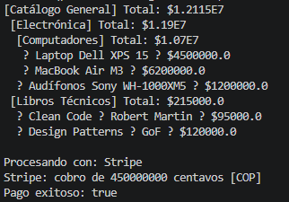
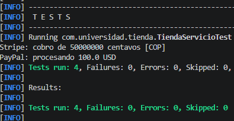

# Tienda Patrones Estructurales

Proyecto de ejemplo en **Spring Boot 3.2.0** que implementa patrones de diseño estructurales (Adapter y Composite) en un sistema de tienda.  
El proyecto demuestra cómo integrar diferentes pasarelas de pago mediante el patrón **Adapter** y cómo organizar productos y categorías con el patrón **Composite**.

---

## 📂 Estructura del Proyecto

    ```text
        tienda-patrones-estructurales/
    ├── pom.xml
    └── src/
        ├── main/
        │   └── java/com/universidad/tienda/
        │       ├── TiendaApp.java
        │       ├── adapter/
        │       │   ├── PasarelaPago.java
        │       │   ├── PayPalAPI.java
        │       │   ├── StripeAPI.java
        │       │   ├── PayPalAdapter.java
        │       │   └── StripeAdapter.java
        │       ├── composite/
        │       │   ├── ItemCatalogo.java
        │       │   ├── Producto.java
        │       │   └── Categoria.java
        │       └── servicio/
        │           └── TiendaServicio.java
        └── test/
            └── java/com/universidad/tienda/
                └── TiendaServicioTest.java


---


## 📖 Patrones Implementados
Adapter: integración de pasarelas de pago (PayPal y Stripe) con una interfaz común PasarelaPago.

Composite: organización jerárquica de productos y categorías, permitiendo cálculos agregados y visualización recursiva.

Servicio (TiendaServicio): orquesta ambos patrones para construir el catálogo y procesar compras.

---


## 🚀 Ejecución de la Aplicación

1. **Compilar el proyecto**  
   Desde la raíz del proyecto:
   ```bash
   mvn clean compile

2. **Ejecutar la aplicación principal**
   ```bash
   mvn spring-boot:run



---

## 🧪 Ejecución de Pruebas

1. Ejecutar los tests
   ```bash
   mvn test


